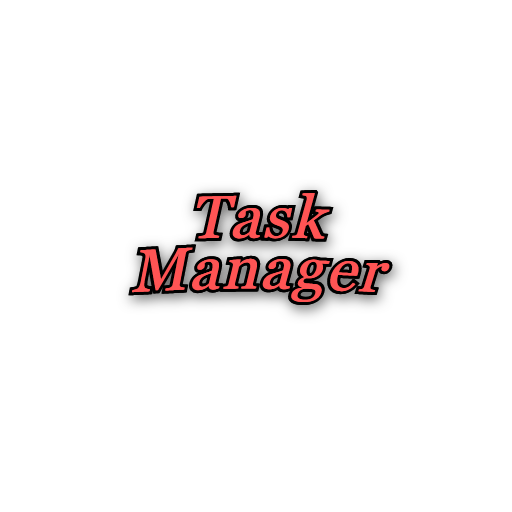

# TaskManager



## 🚀 Como executar 

1. Requisitos
    - Tenha o [.NET SDK](https://dotnet.microsoft.com/pt-br/download/visual-studio-sdks) com o framework .NET 8.0 instalado na sua máquina.

2. Clonar o repositório
    ```
    git clone https://github.com/little-junior/TaskManager.git

3. Execute o arquivo Executar.bat


***Obs: O arquivo é apenas um script para facilitar a execução do projeto, não contendo nenhum conteúdo malicioso. Sinta-se a vontade para inspeciona-lo.***

### 🪪 Como utilizar o sistema

- Para começar a utilizar o sistema, utilize o código de acesso **admin** para conseguir registrar os tech leaders, e posteriormente utilize os acessos criados para usar as outras funcionalidades do sistema.
## 🖥️ Sobre

O seguinte projeto aborda a construção de um Gerenciador de Tarefas utilizando a linguagem C# e o framework .NET 8.0


### 👨‍💻 Entidades 
- Administrador
- Tech Leader
- Desenvolvedor

### 🪄 Funcionalidades
1. Usuários e Responsáveis:
    - Criação de desenvolvedores e tech leaders por área.
    - Cada usuário possui uma chave de acesso única.
    - Os tech leaders têm a capacidade de criar novos desenvolvedores e relacionar tarefas.

2. Tarefas:
    - Criação de tarefas associadas a um desenvolvedor ou tech leader responsável.
    - Mudança de status das tarefas (por exemplo, "Em Progresso", "Concluída", etc.).
    - Aprovação de tarefas por tech leaders.
    - Listagem de tarefas e suas relacionadas para seus respectivos desenvolvedores responsáveis, enquanto tech leaders possuem acesso a todas as tarefas.
    - Cada tarefa pode possuir uma Relação, que junta tarefas em contextos relacionados
    - Edição das tarefas.

## 📖 Tópicos abordados
- Lógica de Programação
- Orientação a Objetos
    - Herança
    - Polimorfismo
    - Abstração
    - Interfaces
    - Encapsulamento
    - etc
- Divisão e arquitetura de projetos
- Windows Forms
- Armazenamento e recuperação de dados via JSON 

## 🤝 Como colaborar

- **Colaborações são totalmente bem-vindas!!**
- Fique a vontade para colaborar fazendo pull requests e abrindo issues.


